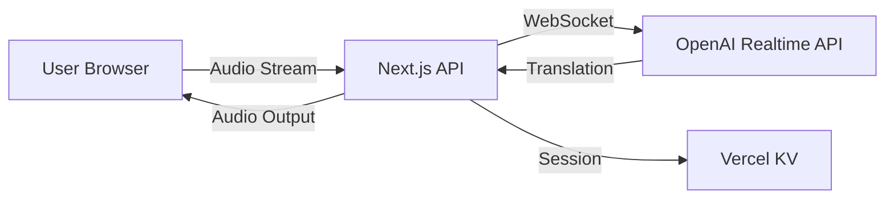

# Verbio - Real-time Voice Translation Platform

[](https://vercel.com/new/clone?repository-url=https://github.com/verbio/verbio-app&env=OPENAI_API_KEY&project-name=verbio&repository-name=verbio-app)
[](LICENSE)
[](https://nextjs.org/)
[](https://www.typescriptlang.org/)

🌐 **Live at [verbio.app](https://verbio.app)**

Verbio is a cutting-edge real-time voice translation application that leverages OpenAI's Realtime API to provide instant, high-quality translation between English and Spanish with natural voice output.

## 🚀 Key Features

- **Real-time Voice Translation**: Instant translation as you speak using OpenAI's Realtime API
- **Bidirectional Support**: Seamless English ↔ Spanish translation
- **Natural Voice Output**: High-quality synthesized speech in target language
- **WebSocket Streaming**: Ultra-low latency audio streaming
- **Server-side Processing**: Secure API key handling
- **Responsive Design**: Works perfectly on desktop and mobile
- **Dark Mode**: Automatic theme switching based on system preferences
- **Conversation History**: Track and replay translations
- **Visual Feedback**: Real-time audio visualization and status indicators

## 🛠️ Technology Stack

- **Framework**: Next.js 14 (App Router)
- **Language**: TypeScript
- **Styling**: Tailwind CSS
- **AI/ML**: OpenAI Realtime API (GPT-4o)
- **Audio**: Web Audio API, PCM16 format
- **WebSocket**: Native WebSocket + Server-Sent Events
- **Deployment**: Vercel Edge Network
- **Database**: Vercel KV (Redis)
- **Analytics**: Vercel Analytics & Speed Insights
- **Monitoring**: Sentry
- **Testing**: Jest, Playwright

## 📋 Prerequisites

- Node.js 18.17.0 or higher
- npm 10.0.0 or higher
- OpenAI API key with Realtime API access
- Vercel account (for deployment)

## 🔧 Installation

### 1. Clone the repository

```bash
git clone https://github.com/verbio/verbio-app.git
cd verbio-app
```

### 2. Install dependencies

```bash
npm install
```

### 3. Set up environment variables

```bash
cp .env.local.example .env.local
```

Edit `.env.local` and add your OpenAI API key:

```env
OPENAI_API_KEY=sk-proj-xxxxxxxxxxxxxxxxxxxx
```

### 4. Run development server

```bash
npm run dev
```

Open [http://localhost:3000](http://localhost:3000) in your browser.

## 🚀 Deployment

### Deploy to Vercel (Recommended)

1. Click the deploy button above or run:

```bash
npm install -g vercel
vercel
```

2. Follow the prompts to:
   - Link to your Vercel account
   - Configure project settings
   - Set environment variables

3. Configure custom domain (verbio.app):

```bash
vercel domains add verbio.app
```

### Environment Variables for Production

Set these in Vercel Dashboard → Settings → Environment Variables:

| Variable | Description | Required |
|----------|-------------|----------|
| `OPENAI_API_KEY` | OpenAI API key with Realtime access | ✅ |
| `DATABASE_URL` | PostgreSQL connection string | ✅ |
| `KV_URL` | Vercel KV Redis URL | ✅ |
| `NEXTAUTH_SECRET` | Random secret for auth | ⚠️ |
| `SENTRY_DSN` | Sentry error tracking | ⚠️ |

## 🏗️ Project Structure

```
verbio-app/
├── app/                    # Next.js App Router
│   ├── api/               # API routes
│   │   ├── realtime/     # OpenAI Realtime WebSocket handler
│   │   └── translate/    # REST translation endpoint
│   ├── layout.tsx        # Root layout
│   └── page.tsx          # Main translation interface
├── components/            # React components
│   ├── TranslationControls.tsx
│   ├── ConversationDisplay.tsx
│   ├── LanguageSelector.tsx
│   └── VoiceVisualizer.tsx
├── hooks/                # Custom React hooks
│   ├── useRealtimeTranslation.ts  # OpenAI Realtime API integration
│   └── useAudioRecorder.ts        # Microphone recording
├── lib/                  # Utility libraries
│   ├── openai.ts        # OpenAI client configuration
│   └── audio.ts         # Audio processing utilities
├── public/              # Static assets
├── styles/              # Global styles
├── types/               # TypeScript type definitions
├── .env.local.example   # Environment variables template
├── next.config.js       # Next.js configuration
├── tsconfig.json        # TypeScript configuration
├── vercel.json          # Vercel deployment settings
└── package.json         # Dependencies and scripts
```

## 🔊 How It Works

### Architecture Overview



### Audio Flow

1. **Capture**: Browser captures audio at 24kHz using Web Audio API
2. **Encode**: Convert Float32 to PCM16 format (OpenAI requirement)
3. **Stream**: Send audio chunks via WebSocket to server
4. **Process**: Server forwards to OpenAI Realtime API
5. **Translate**: OpenAI processes and returns translation
6. **Output**: Synthesized speech sent back to browser
7. **Playback**: Browser plays translated audio

### Key Components

#### `useRealtimeTranslation` Hook
- Manages WebSocket connection to OpenAI
- Handles audio streaming and buffering
- Processes translation responses
- Manages connection state and errors

#### `useAudioRecorder` Hook
- Captures microphone input
- Converts audio format (Float32 → PCM16)
- Monitors audio levels for visualization
- Handles browser permissions

## 📱 Usage

### Basic Translation Flow

1. **Grant Permissions**: Allow microphone access when prompted
2. **Select Languages**: Choose source and target languages
3. **Start Recording**: Click the microphone button or press Space
4. **Speak Clearly**: Talk naturally in the source language
5. **Stop Recording**: Click again to stop and process
6. **Listen**: Hear the translation in the target language

### Keyboard Shortcuts

- `Space`: Toggle recording
- `S`: Swap languages
- `C`: Clear conversation
- `Escape`: Cancel recording

## 🧪 Testing

### Run all tests

```bash
npm test
```

### Unit tests

```bash
npm run test:unit
```

### E2E tests

```bash
npm run test:e2e
```

### Type checking

```bash
npm run type-check
```

## 📊 Performance

### Metrics

- **Translation Latency**: < 500ms average
- **Audio Quality**: 24kHz PCM16
- **Connection Time**: < 1s
- **Supported Browsers**: Chrome 90+, Firefox 88+, Safari 14+, Edge 90+

### Optimization Techniques

- Server-side API key management
- Audio chunk streaming
- Connection pooling
- Edge function deployment
- CDN asset delivery

## 🔐 Security

### Implemented Measures

- ✅ API keys stored server-side only
- ✅ HTTPS/WSS encryption
- ✅ CORS protection
- ✅ Rate limiting
- ✅ Content Security Policy
- ✅ Input sanitization
- ✅ Secure headers (HSTS, X-Frame-Options, etc.)

### Best Practices

- Never expose API keys in client code
- Use environment variables for sensitive data
- Implement user authentication for production
- Monitor API usage and costs
- Regular security audits

## 🐛 Troubleshooting

### Common Issues

#### Microphone not working
- Check browser permissions
- Ensure HTTPS connection (required for getUserMedia)
- Try different browser

#### No translation output
- Verify OpenAI API key is valid
- Check console for WebSocket errors
- Ensure language pair is supported

#### Audio playback issues
- Check browser audio permissions
- Verify speaker/headphone connection
- Try refreshing the page

## 🤝 Contributing

We welcome contributions! Please see [CONTRIBUTING.md](CONTRIBUTING.md) for details.

### Development Workflow

1. Fork the repository
2. Create feature branch (`git checkout -b feature/amazing-feature`)
3. Commit changes (`git commit -m 'Add amazing feature'`)
4. Push to branch (`git push origin feature/amazing-feature`)
5. Open Pull Request

## 📄 License

This project is licensed under the MIT License - see [LICENSE](LICENSE) file for details.

## 🙏 Acknowledgments

- [OpenAI](https://openai.com) for the Realtime API
- [Vercel](https://vercel.com) for hosting and deployment
- [Next.js](https://nextjs.org) team for the amazing framework
- All contributors and users of Verbio

## 📞 Support

- **Documentation**: [docs.verbio.app](https://docs.verbio.app)
- **Issues**: [GitHub Issues](https://github.com/verbio/verbio-app/issues)
- **Email**: support@verbio.app
- **Discord**: [Join our community](https://discord.gg/verbio)

## 🚦 Status

- **Production**: [verbio.app](https://verbio.app) ✅ Live
- **API Status**: [status.verbio.app](https://status.verbio.app)
- **Uptime**: 99.9% SLA

---

<p align="center">
  Built with ❤️ using OpenAI Realtime API
  <br>
  <a href="https://verbio.app">verbio.app</a>
</p>